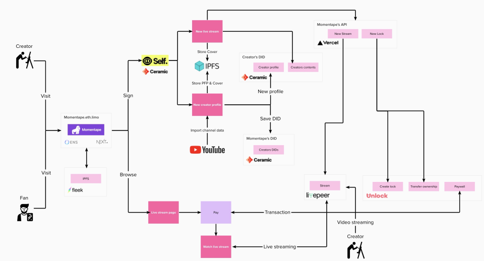
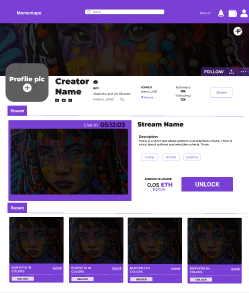
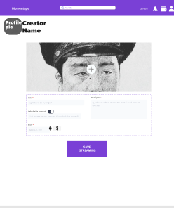
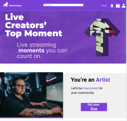

# Project Name

Momentape is a web3 platform that brings artists closer to their fans. To succeed it, we will developp an application with 2 solutions inside : Nft Marketplace & Livestream platform.
For the Eth global hackathon, we focus on the livestream platform.
You will find here the ressources to achieve this :)

## Table of Contents
* [General Info](#general-information)
* [Technologies Used](#technologies-used)
* [Features](#features)
* [Screenshots](#screenshots)
* [Setup](#setup)
* [Usage](#usage)
* [Project Status](#project-status)
* [Room for Improvement](#room-for-improvement)
* [Acknowledgements](#acknowledgements)
* [Contact](#contact)
<!-- * [License](#license) -->

## General Information

- Project:
The project is made on React with Typescript mostly. We used several sponsors technologies : Ceramic, ENS, Livepeer, IPFS/Filecoin and Unlock. We deployed the website on Fleek. The sponsors made us re think the original idea that you can find in the "Long Description". It was supposed to be a NFT marketplace, but for the hackathon it's now a live streaming platform, in the web3, for creators (YouTubers, Instagramers etc.)

- Userjourney Creators :
They can connect their wallet. Then, creators can edit their profile (cover pic, bio, links, etc.) with data imported from YouTube. They can prepare their next stream => price, date, time etc.
- Userjourney Users :
They can connect their wallet. Then, users can directly go to a creator's page to discorver his/her universe, or they can also directly watch one of the next livestream drops. Once users are on a stream page, they will have to pay to unlock the access to the artist live.
- Userjourney Schema :

<!-- You don't have to answer all the questions - just the ones relevant to your project. -->

## Technologies Used
- Front-end: https://nextjs.org/
- Serverless APIs: https://vercel.com/
- Decentralized Web Hosting: https://fleek.co/
- Decentralized Domain (https://momentape.eth.limo/): https://ens.domains/
- Decentralized DNS: https://eth.limo/
- Decentralized Datastore, Authentication (3ID Connect) & Identity (Self.Id): https://ceramic.network/
- Decentralized asset hosting (via Self.Id's image-utils): https://ipfs.io/
- Decentralized live streaming platform: https://livepeer.com/
- Decentralized payment (Unlock.js & Paywall): https://unlock-protocol.com/
- Blockchain RPC: https://www.alchemy.com/
- YouTube APIs: https://developers.google.com/youtube/v3

## Features
List the ready features here:
- Awesome feature 1
- Awesome feature 2
- Awesome feature 3

## Screenshots
- Momentape Structure

- Momentape Figma

<!-- If you have screenshots you'd like to share, include them here. -->

## Setup
What are the project requirements/dependencies? Where are they listed? A requirements.txt or a Pipfile.lock file perhaps? Where is it located?

Proceed to describe how to install / setup one's local environment / get started with the project.

## Usage
How does one go about using it?
Provide various use cases and code examples here.

`write-your-code-here`

## Project Status
Project is: _in progress_.The project is still in progress, it's born during the WEB3JAM hackathon.
We will launch our MVP during the first weeks of 2022.

## Room for Improvement
Include areas you believe need improvement / could be improved. Also add TODOs for future development.

Room for improvement:
- Frontend
- Improvement to be done 2

To do:
- Feature to be added 1
- Feature to be added 2

## Acknowledgements
Give credit here.
- This project was inspired by all the content creators in the world :)
- This project is online on [website](https://momentape.eth.limo/).
- Many thanks to all the team, ETHGLobal for the organization and all the sponsors.

## Contact
Created by [@flynerdpl](https://www.flynerd.pl/) - feel free to contact me!

<!-- Optional -->
<!-- ## License -->
<!-- This project is open source and available under the [... License](). -->

<!-- You don't have to include all sections - just the one's relevant to your project -->
