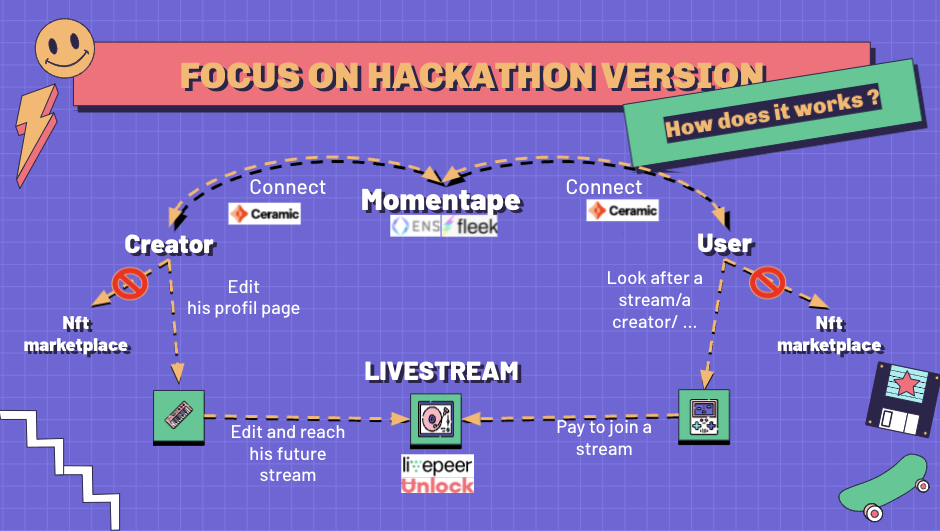
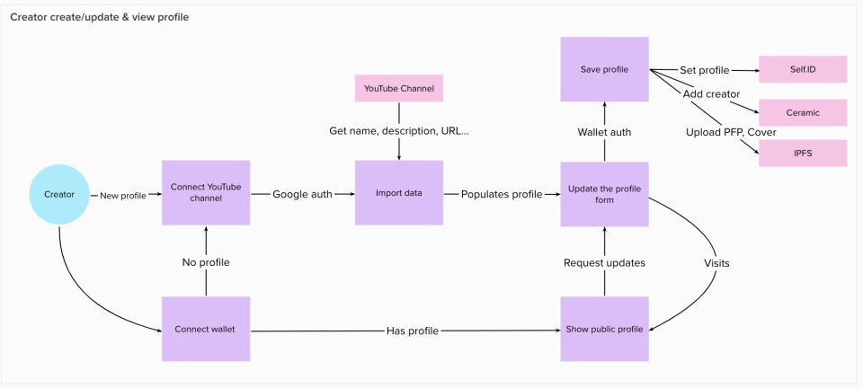
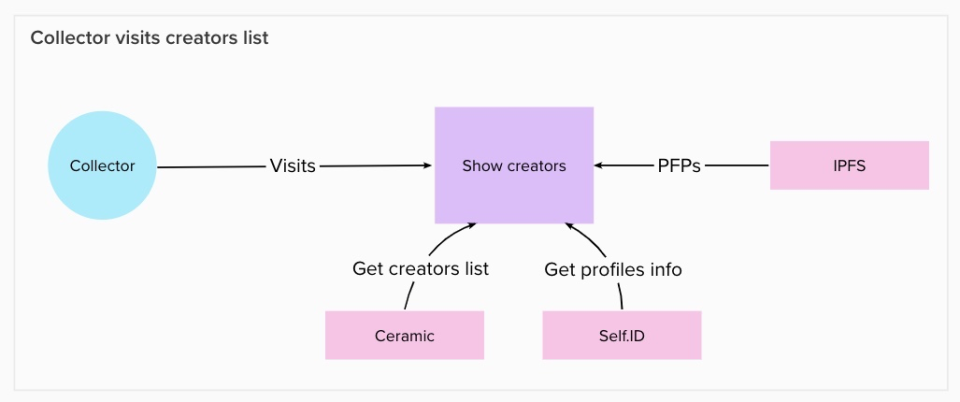
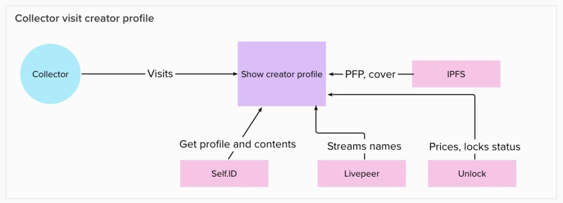
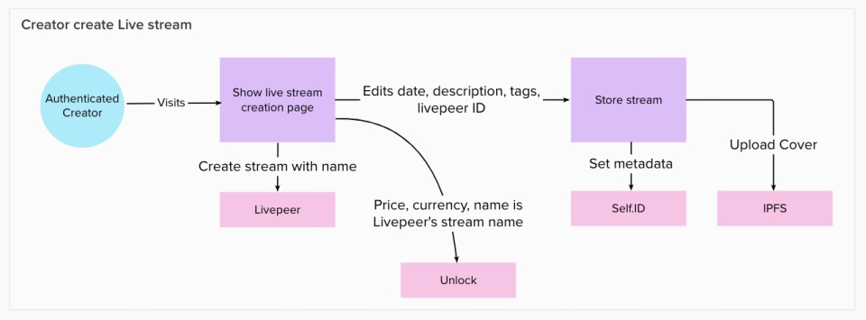
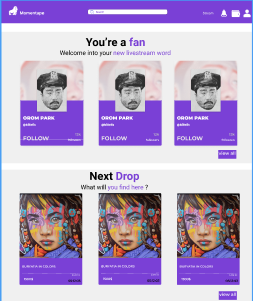

# Momentape

Momentape is a web3 platform that brings artists closer to their fans. To succeed it, we will develop an application with 2 solutions inside : NFT Marketplace & Live streaming platform.
For the ETHGlobal hackathon, we focus on the live streaming platform.
You will find here the ressources to achieve this :)

## Table of Contents
* [General Information](#general-information)
* [User Journeys](#user-journeys)
* [Data flows](#data-flows)
* [Solution Design](#solution-design)
* [Technologies Used](#technologies-used)
* [Features](#features)
* [Screenshots](#screenshots)
* [Setup](#setup)
* [Project Status](#project-status)
* [Room for Improvement](#room-for-improvement)
* [Acknowledgements](#acknowledgements)
* [Contact](#contact)

## General Information

- Team
  - Leo Filipetti : Product Manager / [Linkedin](https://www.linkedin.com/in/leo-filipetti/)
  - Luca Perret :  Lead tech / [Github](https://github.com/lucaperret)
  - Nijat hasanli : Developer /  [Github](https://github.com/nhasanli)
  - Jean Dumas : Product Manager /[Linkedin](www.linkedin.com/in/jean-dumas-5b32ab56)

- Project:
The project is made on React with Typescript mostly. We used several sponsors technologies : Ceramic, ENS, Livepeer, IPFS and Unlock. We deployed the website on Fleek.

## User Journeys
- Creators:
They can connect their wallet and decentralized identity. Then, creators can edit their profile (pfp, cover pic, bio, links, etc.) with data imported from YouTube. They can prepare their next stream => price, date, time etc.
- Fans :
Fans directly go to a creator's page to discorver his/her universe, or they can also directly watch one of the livestream drops. Once users are on a stream page, they will have to pay to unlock the access to the artist live.
- Schema :

## Data Flows

## Solution Design

## Technologies Used
- Front-end: https://nextjs.org/
- Serverless APIs: https://vercel.com/
- Decentralized Web Hosting: https://fleek.co/
- Decentralized Domain (https://momentape.eth.limo/): https://ens.domains/
- Decentralized DNS: https://eth.limo/
- Decentralized Datastore, Authentication (3ID Connect) & Identity (Self.Id): https://ceramic.network/
- Decentralized asset hosting (via Self.Id's image-utils): https://ipfs.io/
- Decentralized live streaming platform: https://livepeer.com/
- Decentralized payment (Unlock.js & Paywall): https://unlock-protocol.com/
- Blockchain RPC: https://www.alchemy.com/
- YouTube APIs: https://developers.google.com/youtube/v3

## Screenshots

| Homepage  | Homepage 2 |
| ------------- | ------------- |
|  |  |
| Creator Page  | Edit Stream Page  |
|  | |

## Setup

### Front-end

1) Clone this repository
2) `npm install`
3) `npm run dev`

### Back-end APIs

1) Clone the [momentape-api](https://github.com/lucaperret/momentape-api) repository
2) `npm install -g vercel` + `npm install`
3) Generate a seed from your terminal: `node -e "console.log(require('crypto').randomBytes(32).toString('hex'))"`
4) Create a `.env` file with `SEED=YOUR_GENERATE_SEED` and an account private key `PV_KEY=YOUR_ACCOUNT_KEY`
5) `vercel dev`

## Project Status
Project is: _in progress_.It's born during the WEB3JAM hackathon.
We will launch our MVP during the first weeks of 2022.

## Room for Improvement
Include areas you believe need improvement / could be improved. Also add TODOs for future development.

Room for improvement:
- Frontend integration and design
- LivePeer stream URL proxied
- Use Fluence vs Vercel for decentralized API
- Enabling credit cards payment to Unlock contents

To do:
- Edit Stream info
- Creator funds withdraw
- Mainnet deployment (Ceramic, Unlock)
- Momentape's fee
- NFT marketplace

## Acknowledgements
- This project was inspired by all the content creators in the world :)
- This project is online on [website](https://momentape.eth.limo/).
- Many thanks to all the ETHGLobal team for the organization and all the sponsors.

